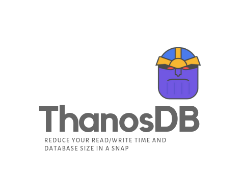

<h1 align="center">
	
	<br>
	<br>
</h1>


[](https://GitHub.com/Naereen/StrapDown.js/graphs/commit-activity) [](https://www.python.org/) [](https://github.com/dwyl/esta/issues)

## ThanosDB

A lightweight, fast and simple database based on [msgpack](<https://msgpack.org/index.html>) module. It is an platform agnostic, open-source **key-value** store. There are two primary reasons why this project came into existence -

1. To temporarily store JSON data for Flask Servers without the need to setup any Database.
2. To act as an alternative to Redis, since there is no official support of Redis on windows ([Drawbacks of Redis on Windows](<https://redislabs.com/ebook/appendix-a/a-3-installing-on-windows/a-3-1-drawbacks-of-redis-on-windows/>)). 

In order to justify its name, it will *try* to - 

1. Reduce the read/write time of your database.
2. Reduce the size of your storage. (*When compared to JSON*)

##### Why ThanosDB uses MessagePack instead of using JSON, BSON?

[MessagePack](https://msgpack.org/index.html) is an efficient binary serialization format. It lets us exchange data among multiple languages like JSON. **But it's faster and smaller**. Small integers are encoded into a single byte, and typical short strings require only one extra byte in addition to the strings themselves. 

[Benchmarking](https://github.com/ludocode/schemaless-benchmarks) - MessagePack outperforms every other Data Serialization formats.

#### Get, Set, Snap

```python
>>> from thanosdb import thanosdb
>>> db = thanosdb.load('test.db', False)
>>> db.set('key', 'value')
True
>>> db.get('key')
'value'
>>> db.dump()
True
```

#### Testing

Testing in ThanosDB is done using Python's [unittest](https://docs.python.org/2/library/unittest.html) module.

In order to run test go inside the package directory and run the following command

```shell
python -m unittest
```

#### Developers - 

- Shril Kumar ([@shril](https://github.com/shril))
- Abhishek Srivastava ([@abhishekai](https://github.com/abhishekai))
- Janpreet Singh ([@janismdhanbad](https://github.com/janismdhanbad))

